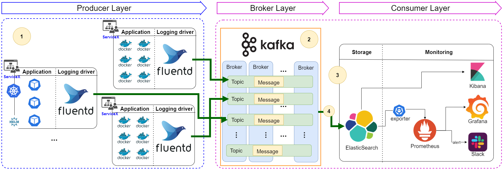

## Collect raw log by Fluentd to Kafka, ElasticSearch and Kibana 

## I. High level architecture



- In here, we collect raw log from multiple source using Fluentd. After that, Fluentd send log to Kafka.
- Sync data from Kafka to ElasticSearch
- Using Prometheus, Grafana to monitor Elastic cluster health
## II. Deployment guide:

### 1. Run docker-compose:
```shell
docker-compose -f docker-compose.yaml up -d
```
### 2. Setup Kafka-connect-ElasticSearch plugin:
- Please take a look on [main repo](https://github.com/confluentinc/kafka-connect-elasticsearch)
- Please **read carefully** [technical document](https://docs.confluent.io/kafka-connect-elasticsearch/current/overview.html)
- Download ElasticSearch Sink Connector plugin at [link](https://www.confluent.io/hub/confluentinc/kafka-connect-elasticsearch?_ga=2.186461033.1146845704.1640941015-936199150.1640662320)

```shell
curl --location --request GET 'localhost:8083/connector-plugins' \
--header 'Content-Type: application/json' \
--data-raw '{
    "name": "simple-elasticsearch-connector",
    "config": {
        "connector.class": "io.confluent.connect.elasticsearch.ElasticsearchSinkConnector",
        "connection.url": "http://es01:9200",
        "tasks.max": "1",
        "topics": "fluentd-topic",
        "type.name": "_doc"
    }
}'
```

```shell
curl --location --request POST 'localhost:8083/connectors' \
--header 'Content-Type: application/json' \
--data-raw '{
    "name": "simple-elasticsearch-connector",
    "config": {
        "connector.class": "io.confluent.connect.elasticsearch.ElasticsearchSinkConnector",
        "connection.url": "http://es01:9200",
        "tasks.max": "1",
        "topics": "fluentd-topic",
        "type.name": "_doc",
        "value.converter": "org.apache.kafka.connect.json.JsonConverter",
        "value.converter.schemas.enable": "false",
        "schema.ignore": "true",
        "key.ignore": "true"
    }
}'
```

```shell
curl --location --request PUT 'localhost:8083/connectors/simple-elasticsearch-connector/config' \
--header 'Content-Type: application/json' \
--data-raw '{
    "connector.class": "io.confluent.connect.elasticsearch.ElasticsearchSinkConnector",
    "connection.url": "http://es01:9200",
    "tasks.max": "1",
    "topics": "fluentd-topic",
    "name": "simple-elasticsearch-connector",
    "type.name": "_doc",
    "value.converter": "org.apache.kafka.connect.json.JsonConverter",
    "value.converter.schemas.enable": "false",
    "schema.ignore": "true",
    "key.ignore": "true"
}'
```
### 3. Verify infrastructure:

### Docker-compose.yml
```
version: '3'
services:
  web:
    image: httpd
    ports:
      - "80:80"
    links:
      - fluentd
    logging:
      driver: "fluentd"
      options:
        fluentd-address: localhost:24224
        tag: httpd.access

  fluentd:
    build: ./fluentd
    volumes:
      - ./fluentd/conf:/fluentd/etc
    links:
      - "elasticsearch"
    ports:
      - "24224:24224"
      - "24224:24224/udp"

  elasticsearch:
    image: docker.elastic.co/elasticsearch/elasticsearch:7.13.1
    environment:
      - "discovery.type=single-node"
    expose:
      - "9200"
    ports:
      - "9200:9200"

  kibana:
    image: docker.elastic.co/kibana/kibana:7.13.1
    links:
      - "elasticsearch"
    ports:
      - "5601:5601"
```
### fluent.conf
```
<source>
  @type forward
  port 24224
  bind 0.0.0.0
</source>
<label @FLUENT_LOG>
  <match *.**>
    @type copy
    <store>
      @type elasticsearch
      host elasticsearch
      port 9200
      logstash_format true
      logstash_prefix fluentd
      logstash_dateformat %Y%m%d
      include_tag_key true
      type_name access_log
      tag_key @log_name
      flush_interval 1s
    </store>
    <store>
      @type stdout
    </store>
  </match>
</label>
```
### Dockerfile 
```
FROM fluent/fluentd:v1.12.0-debian-1.0
USER root
RUN ["gem", "install", "fluent-plugin-elasticsearch", "--no-document", "--version", "5.0.3"]
USER fluent
```

### Command
`docker-compose up -d`

If you alreay have the image and just want to rebuild fluentd with the new debian and gem version run:  
`docker-compose up -d --build`

### Site Info
http://localhost:5601

## III. Contributor guide:
- Please fork the repo and make a Pull Request
- After taking a serious review, we will accept your Pull Request as well

## IV. License MIT

Open source MIT license
